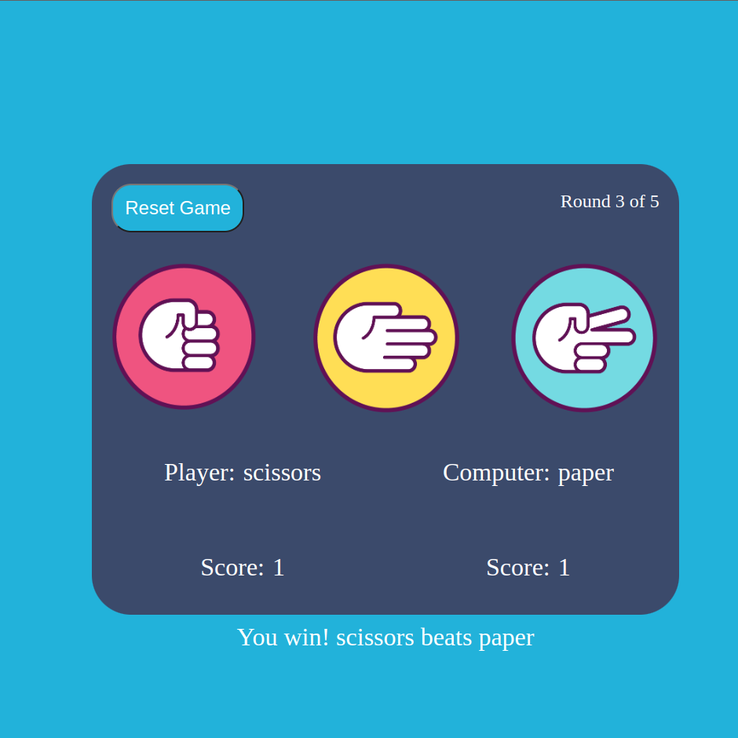
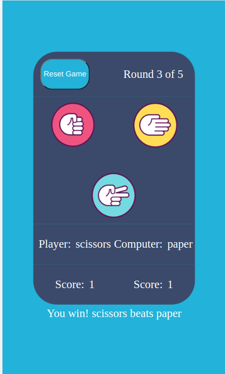

# Rock-Paper-Scissors
* Rock-paper-scissors game written with HTML, CSS, and JavaScript.
* Created this project as part of the *The Odin Project*'s ***Foundations*** curriculum [Rock-Paper-Scissors](https://www.theodinproject.com/lessons/foundations-revisiting-rock-paper-scissors)
* [Live](https://ronmurphy33.github.io/rock-paper-scissors/)

## How to Play
* The game is 5 rounds of rock paper scissors, player vs computer.
* Rounds that are tied are not counted and played again. 
* The player simply clicks on their choice to start the game and to play subsequent rounds. 

